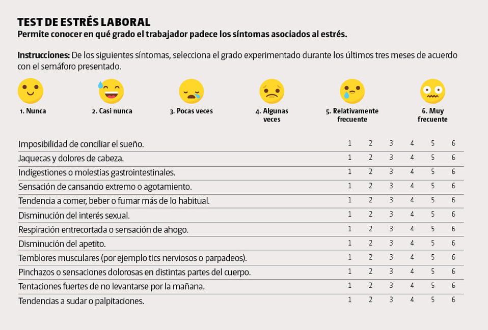
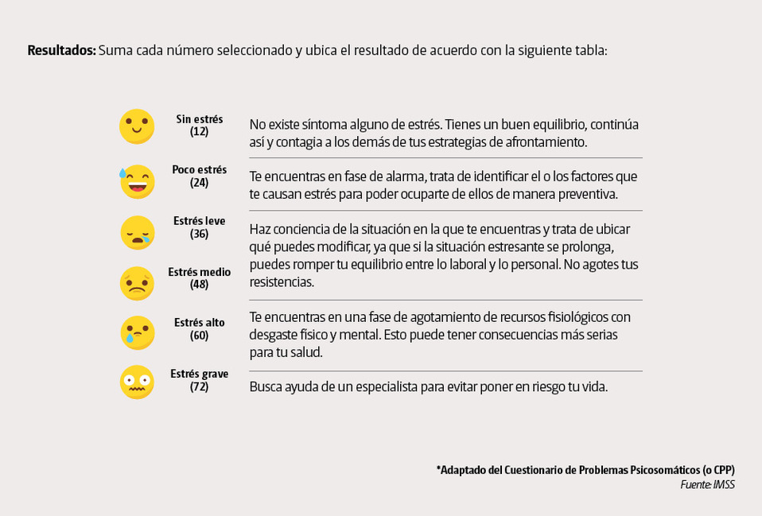

<div style="text-align: justify">
## Título corto: CommUtec
## P5 Entrega Final
### **Sección:** 1.01
### **Profesor:** José Miguel Renom

**Alumno** | **Código** | **Líder**
-----------|------------|----------
Kevin Aubert|201910019|       
Andrea Chu |201910124   |
Juan Diego Chu|201920069|    
Oscar Gómez|201910179   |    
Joaquín Ramírez|201910277|    X

### Introducción

El transporte urbano de Lima está en un estado deplorable debido a años de corrupción y manejo indebido de los recursos públicos. Uno de los principales problemas en una sociedad urbanizada es la movilización eficiente de los ciudadanos en el limitado espacio disponible.  Según un estudio realizado por la empresa holandesa TomTom (2018), Lima es la tercera ciudad con más tráfico en el mundo. Esto significa que muchos limeños debemos invertir una gran cantidad de horas en transportarnos, debido a que el tráfico nos impide llegar a lugares más rápidamente. 

Como estudiantes, consideramos que este tema es importante para nosotros y nuestros compañeros porque todos vivimos en Lima y debemos transportarnos a la universidad frecuentemente. Muchas de estas veces, nos topamos con el tráfico y largas horas de movilidad. Todo esto resulta en una carga físico-emocional que repercute en la vida diaria estudiantil, el cual no nos permite rendir a nuestro máximo potencial.


### Objetivo

El objetivo de esta investigación es analizar e informar acerca del impacto que tiene el transporte desde la residencia de un alumno hasta la universidad en su tiempo efectivo de trabajo, rendimiento académico y estilo de vida.

### Marco Teórico

### Población objetivo

Estudiantes de UTEC

### Unidad muestral

Cualquier estudiante de UTEC cursando ciclo II en adelante

### Tipo de muestreo

Muestreo por conveniencia: fácil acceso a nuestra unidad muestral

### Obtención de datos

Al ser parte de la comunidad estudiantil de la misma universidad, tenemos acceso a los medios de comunicación pertinentes para realizar encuestas en línea. Es así que se elaboró una encuesta en GoogleForms, y se distribuyó la misma vía el grupo de Facebook de los alumnos. Asimismo, solicitamos ayuda del área de Bienestar Estudiantil que nos apoyó con la distribución de la encuesta. Nota: para poder responder las preguntas que toman los factores de opinión y el plano emocional, se utilizó escalas psicométricas, como la escala de Likert.


### Preguntas planteadas
N°|Pregunta|Tipo de pregunta
--|-------------------------------------------------------------------------------------------------|-----------------
1|¿Cuánto tiempo les demora a los estudiantes de UTEC llegar a la universidad desde su lugar de residencia?|Descriptiva
2|¿Cómo califican los estudiantes la experiencia de transporte?|Descriptiva
3|¿Cuál es el medio de transporte más utilizado?|Descriptiva
4|¿Qué tan estresados se sentían los alumnos de UTEC el ciclo 2019-2?|Descriptiva
5|¿Cuántas horas de sueño tienen los alumnos de UTEC?|Descriptiva
6|¿Existe una relación entre el número de horas que duermen los estudiantes y el nivel de estrés que presentan?|Exploratoria
7|¿Existe alguna relación entre el tiempo que pasan en el transporte y la cantidad de cursos desaprobados del estudiante?|Exploratoria
8|¿Los estudiantes que viajan más a la semana dormirán una menor cantidad de horas?|Inferencial
9|¿Los estudiantes que viajan menos horas a la semana en el transporte tendrán una mejor calificación  de este?|Inferencial
10|¿Es posible predecir las horas de sueño que tendrán los alumnos conociendo su nivel de estrés y la calificación de su experiencia en el transporte?|Predictiva
11|¿Es posible predecir la calificación sobre el transporte conociendo únicamente el número de horas que se transportan a la semana?|Predictiva
12|¿Qué factores y condiciones en los que se desarrolla el alumno determinan la calificación que tendrás sobre el transporte?|Causal 
13|¿De qué manera  algunos factores afectan la calificación de los alumnos sobre el transporte?|Mecanística


### Variables del Estudio

Variable|Relación con pregunta|Tipo de variable
-----------------------------|--------------------|----------------
Calificación de la Experiencia de transporte|2,9,10,11,12,13|Categórica ordinal
Tiempo de transporte diario|1,7,12,13|Numérica continua
Cantidad de cursos desaprobados|7|Numérica discreta
Medios de transporte|3,12,13|Categórica nominal
Cantidad de días con clases|8,9,11,12,13|Numérica discreta
Cantidad de horas semanales de clases|12,13|Numérica continua
Horas de sueño diarias|5,6,8,10|Numérica continua
Distrito de Residencia|12,13|Categórica nominal
Tiempo de transporte semanal|8,9,11,12,13|Numérica continua
Nivel de estrés (referencial basado en escala)|4,6,10|Categórica ordinal

**Para medir el nivel de estrés utilizamos el siguiente Cuestionario de Problemas Psicosomáticos(CPP) del Instituto Mexicano del Seguro Social:**



```{r warning=FALSE}
#install.packages("RColorBrewer")
```

### Base de Datos
```{r}
library(RColorBrewer)
library(readr)
library(dplyr)
DF<-read_csv("Base_DatosFINAL.csv")
```


### ANÁLISIS DESCRIPTIVO
### ¿Cuánto tiempo les demora a los estudiantes de UTEC llegar a la universidad desde su lugar de residencia?
**ANÁLISIS:** A partir de la gráfica podemos observar que el promedio de tiempo de transporte de los estudiantes es de 51.81 minutos y que la mediana es de 45 minutos; lo que significa que más de la mitad de los alumnos se demora menos de 45 minutos. Asimismo, el tiempo máximo es de 150 minutos y el mínimo de 2 minutos, lo cual podría ser causado por la distancia a su residencia o el método de transporte utilizado. Finalmente, mediante la relación entre media y mediana obtenemos que la distribución de datos es sesgada hacia la derecha.
```{r}
summary(DF$Tiempo_Transporte/2)
```

```{r}
boxplot(DF$Tiempo_Transporte/2)
abline(mean(DF$Tiempo_Transporte/2),0,col="red",title("Tiempo de viaje hasta la Universidad"), lwd=2)
legend("topright", 
       c("Media"), 
       lty=1, 
       col=c("red"), 
       bty = "o", title="Leyenda",bg="transparent")


```

### ¿Cómo califican los estudiantes la experiencia de transporte?
**ANÁLISIS:** La gráfica presenta la distribución de la frecuencia referente a la calificación de la experiencia de transporte de los estudiantes de la UTEC. Se puede observar que la mayoría de estudiantes califica el transporte con un valor relativamente alto con una mediana de 7 y una media de 6.572. Basándonos en esto se puede concluir que la mayoría de los estudiantes califica su experiencia de transporte como positiva.

```{r}
summary(DF$Calificacion)
```

```{r}
col <- brewer.pal(9, "RdYlGn")
barplot(table(DF$Calificacion), xlab="Calificación (Mayor es mejor)", ylab="Frecuencia", las=1,cex.names=1,ylim=c(0,35), col=c("red",col), main = "Calificación de experiencia de transporte")
```


### ¿Cuál es el medio de transporte más utilizado?
**ANÁLISIS:** La gráfica presenta la distribución porcentual referente a los medios de transportes más utilizados para movilizarse entre la residencia de los alumnos y la universidad. Del gráfico se puede observar que el transporte más usado es el _micro/combi_ con un 28%, seguido  por los transporte del _carro particular_ y del _taxi_ con un 20% y 14.8% respectivamente.
```{r}
medios <- read_csv("TransporteF.csv") #medios es igual a la suma de M1, M2, M3 Y M4 en DF
```
**Porcentajes de los medios de transporte (%):**
```{r}
round(table(medios$Actividad)/length(medios$Actividad)*100,2)
```

```{r}
mosaicplot(sort(table(medios$Actividad)),
 main="¿Qué transporte utilizan los estudiantes de UTEC?",
 col="skyblue", las=1,cex.axis = 0.5)
```

### ¿Qué tan estresados se sentían los alumnos de UTEC el ciclo 2019-2?
**ANÁLISIS: **En el gráfico se puede apreciar que aproximadamente la moda entre los alumnos de UTEC es un nivel de estrés leve, mientras que la mediana es un nivel de estrés medio. Asimismo se sabe que la mayoría de alumnos tienen _Estrés leve  (25 a 36) o Estrés medio (37 a 48)_ con un porcentaje en los alumnos de 30% y 29.44% respectivamente. Finalmente se observa que la cantidad de alumnos con _Estrés grave_ es muy baja, ocurriendo solamente en el 8.33% de los alumnos.

```{r}
rangos_estres <- round(table((cut(DF$Estres,breaks=seq(12,83,by=12), include.lowest = TRUE)))/nrow(DF),4)*100
```

```{r}
coul <- brewer.pal(5, "RdYlGn")
coulf=c()
for (i in 1:5){
  coulf=c(coulf,coul[6-i])
}
barplot(table((cut(DF$Estres,breaks=seq(12,83,by=12), include.lowest = TRUE))), ylim = c(0,60),col =coulf, space = 0,names.arg = c("Poco","Leve","Medio","Alto","Grave"),xlab="Nivel de Estrés", ylab="Frequency",main="Nivel de estrés de los alumnos de UTEC")
legend("topright", 
       c("Mediana"), 
       lty=c(2, 2), 
       col=c("red"), 
       bty = "o", title="Leyenda",bg="lightblue")
abline(v=5*median(DF$Estres)/72,col="red", lwd=3,lty=3)
```
**Porcentaje de Niveles de Estrés en Alumnos (%):**

**Poco Estrés:**
```{r}
rangos_estres[1]
```
**Estrés leve:**
```{r}
rangos_estres[2]
```
**Estrés medio:**
```{r}
rangos_estres[3]
```
**Estrés alto:**
```{r}
rangos_estres[4]
```
**Estrés grave:**
```{r}
rangos_estres[5]
```


### ¿Cuántas horas de sueño tienen los alumnos de UTEC?
**ANÁLISIS: **En el histograma se puede observar que la mediana es 6 horas diarias de sueño, lo que significa que al menos la mitad de los alumnos duerme menos de 6 horas. No obstante, son escasos los casos de estudiantes durmiendo horas mínimas como 3 o 4. Adicionalmente, es importante denotar que el estudiante promedio de UTEC no está durmiendo las horas mínimas (8) recomendadas por expertos para poder mantener su cuerpo sano.
```{r}
coul <- brewer.pal(6, "RdYlGn") 
barplot(table((cut(DF$Tiempo_Dormir,breaks=seq(2,8,by=1)))), ylim = c(0,70),col =coul, space = 0,names.arg = c(3:8),xlab="Horas de Sueño", ylab="Frequency",main="Horas de sueño de los alumnos de UTEC")
legend("topright", 
       c("Mediana"), 
       lty=c(2, 2), 
       col=c("red"), 
       bty = "o", title="Leyenda",bg="lightblue")
abline(v=median(DF$Tiempo_Dormir)/2 + 0.5,col="red", lwd=3,lty=3)
```


### Parámetros del estudio

**Tamaño de Muestra:** 180 encuestados

**Nivel de Confianza:** 95%
Elegimos un nivel de confianza del 95% puesto que esto significa que si hubiésemos hecho 20 muestreos y creado 20 intervalos de confianza; se esperaría que 19 de ellos contengan la media de la población. Lo cual representa un porcentaje bastante aceptable para una investigación. Además, 95% es el valor que usualmente se utiliza en este tipo de trabajos.

**Nivel de Significancia:** 0.05
El nivel de significancia para este caso estará dado por $\alpha=0.05$, el cuál participa en el cálculo del nivel de confianza según la ecuación $1-\alpha= \text{Nivel de confianza}$.

**Tolerancia:**
La tolerancia (epsilon) está dada en la fórmula:
$$\mathbb{P}(\left\vert \overline{X}_n - \mu \right\vert \leq \varepsilon)\geq 1-\alpha$$
De la cual se llega a:

$$\varepsilon=\frac{Z_a\sigma}{\sqrt{n}}$$ 
$$a=\alpha/2$$
Pero como Z es:
```{r}
alfa<- 0.05 
n=180
z<- qnorm(alfa/2, lower.tail = FALSE)
"Z="
round(z,2)
```
Finalmente la tolerancia quedaría como:
$$\varepsilon=\frac{Z\sigma}{\sqrt{180}}$$
Donde se utiliza el valor de la desviación estándar de cada variable para $sigma$.


### Intervalos de confianza 
La fórmula de los intervalos de confianza es la siguiente:
$$[\overline{X}-\varepsilon, \overline{X}+\varepsilon]$$ 
Usamos la fórmula para hallar los intervalos de confianza de las principales variables del estudio:

**TIEMPO DE TRANSPORTE DIARIO**
```{r}
T1<-mean(DF$Tiempo_Transporte)-z*(sd(DF$Tiempo_Transporte)/sqrt(180))
T2<-mean(DF$Tiempo_Transporte)+z*(sd(DF$Tiempo_Transporte)/sqrt(180))
T1
T2
```
**Intervalo de Confianza para la media del Tiempo de Transporte diario=** [93.50873, 113.7246]

**TIEMPO DE TRANSPORTE SEMANAL**
```{r}
TS1<-mean(DF$Transporte_Semanal)-z*(sd(DF$Transporte_Semanal)/sqrt(180))
TS2<-mean(DF$Transporte_Semanal)+z*(sd(DF$Transporte_Semanal)/sqrt(180))
TS1
TS2
```
**Intervalo de Confianza para la media del Tiempo de Transporte semanal=** [470.9614, 576.8719]

**HORAS DE SUEÑO:**
```{r}
HS1<-mean(DF$Tiempo_Dormir)-z*(sd(DF$Tiempo_Dormir)/sqrt(180))
HS2<-mean(DF$Tiempo_Dormir)+z*(sd(DF$Tiempo_Dormir)/sqrt(180))
HS1
HS2
```
**Intervalo de Confianza para la media de Horas de Sueño=** [6.064811, 6.401855]

**NÚMERO DE CURSOS REPROBADOS**
```{r}
NR1<-mean(DF$NroReprobados)-z*(sd(DF$NroReprobados)/sqrt(180))
NR2<-mean(DF$NroReprobados)+z*(sd(DF$NroReprobados)/sqrt(180))
NR1
NR2
```
**Intervalo de Confianza para la media de Número de cursos Reprobados=** [0.2222592, 0.3888519]

### ANÁLISIS EXPLORATORIO E INFERENCIAL

### ¿Existe una relación entre el número de horas que duermen los estudiantes y el nivel de estrés que presentan?
**RELEVANCIA PARA EL ESTUDIO: **

La importancia de esta pregunta en el estudio se debe a que el nivel de estrés y las horas de sueño diarias están ligadas con el estilo de vida y con la organización del tiempo de un estudiante de UTEC.

**ANÁLISIS EXPLORATORIO:** 

Se puede observar que todos los estudiantes que tienen un nivel de _estrés bajo_ duermen 5 horas o más. Además se puede ver una cierta tendencia en la gráfica que apoya nuestra hipótesis nula que los estudiantes que duermen menos sufren de un mayor nivel de estrés.

**HIPÓTESIS:** 
**H0:** Los estudiantes que tienen un nivel de estrés mayor, duermen menos horas diariamente.

```{r}
smoothScatter((cut(DF$Estres,breaks=seq(12,83,by=12), include.lowest = TRUE)), DF$Tiempo_Dormir,ylab= "Horas diarias de Sueño",xlab="Nivel de Estrés", col = coul)
legend("bottomright",
       c("1 -- Poco", "2 -- Leve","3 -- Medio","4 -- Alto","5 -- Grave"), 
       bty = "o", title="Leyenda",bg="transparent",pt.cex = 1,cex = 0.7)
```


```{r}
DF%>% filter()%>%group_by(Tiempo_Dormir)%>%summarise(Media_Tiempo=mean(Transporte_Semanal),Mediana_Tiempo=median(Transporte_Semanal))->dormir_transporte
dormir_transporte
```

**ANÁLISIS INFERENCIAL:**

Utilizaremos el valor de estrés medio, **48**, para usarlo como punto medio para los estudiantes que tienen un estrés mayo o menor que la mayoría.

```{r}
Estresmayor<-(DF[which(DF$Estres>48),])
summary(Estresmayor$Tiempo_Dormir)
```
Asimismo, consideraremos un tiempo de sueño inferior cuando este se ubique por debajo de la media de **5.907 horas**.
 

**H0:** Los que tienen un nivel de estrés mayor duermen menos.

**H1:** El tiempo que duerme un alumno no afecta su nivel de estrés.  

**Nivel de confianza:** 95%

**alpha**=0.05
```{r}
t.test(Estresmayor$Tiempo_Dormir,mu=5.907,alternative="greater", conf.level = 0.95)
```

Como el p-value es mayor a nuestro alpha, **(0.5>0.05)**, no es posible descartar satisfactoriamente la hipótesis nula declarándola estadísticamente insignificante. Entonces se puede decir que a un nivel de significancia del 5% es posible decir que los alumnos que que tienen un nivel de estrés mayor duermen menos.

```{r}
boxplot(DF$Estres~DF$Tiempo_Dormir,main="Nivel de estrés vs horas de sueño", xlab= "Tiempo de sueño diario (h)",ylab="Estrés (CPP)")
abline(h=median(DF$Estres),col="red")
legend("topright", c("Mediana"),lty=c(1), col=c("red"),title="Leyenda",bg="white")
```
**Prueba chi-squared**

H0: Las variables son independientes
H1: Las variables son dependientes

```{r}
chisq.test(table(DF$Estres, DF$Tiempo_Dormir))
```
El p-value es mayor a la significancia, entonces no se puede rechazar la hipótesis nula.

**ANÁLISIS FINAL**
Si bien en la prueba chi-squared no se pudo descartar que estas variables son independientes, al hacer el t-test, no se pudo descartar que los alumnos que tienen un nivel de estrés mayor duermen menos. Además, en la gráfica se observa una tendencia que indica que las personas que tienen menos horas de sueño tienen un nivel de estrés mayor confirmando nuestra hipótesis y relacionando directamente un mayor nivel de estrés con menor horas de sueño.


### ¿Existe alguna relación entre el tiempo que pasan en el transporte y la cantidad de cursos desaprobados del estudiante?
**RELEVANCIA PARA EL ESTUDIO: **

Esta Pregunta es relevante al estudio ya que nos permite averiguar la relación que tienen los estudiantes que se toman más tiempo en transportarse hacia la universidad y cuantos cursos desaprobados tuvieron. Además de estas dos variables, también nos permitirá relacionar el tiempo de transporte con promedio ponderado ya que un curso reprobado reducirá este. 

**ANÁLISIS EXPLORATORIO:** 

En el gráfico se puede observar que la mediana para 0 cursos desaprobados es menor a la mediana de 1 curso y 2 cursos desaprobados; por lo que parece que existiría una relación entre estas variables.

**HIPÓTESIS:** 
**H0:** Los alumnos que pasan un mayor tiempo al transportarse hacia la universidad tendrán un mayor número de cursos desaprobados.

```{r}
boxplot(DF$Tiempo_Transporte~DF$NroReprobados,main="Tiempo transporte diario (min) vs Cursos Reprobados", xlab= "Cursos reprobados",ylab="Tiempo transporte diario (min)")
abline(h=median(DF$Tiempo_Transporte),col="red")
legend("topright", c("Mediana"),lty=c(1), col=c("red"),title="Leyenda",bg="white")
```

**ANÁLISIS INFERENCIAL:** 

**H0: ** Los alumnos que pasan un mayor tiempo al transportarse hacia la universidad tendrán un mayor número de cursos desaprobados.

**H1:** Los alumnos que pasan un mayor tiempo al transportarse hacia la universidad tendrán un menor número de cursos desaprobados.

**Nivel de confianza:** 95%

**alpha**=0.05


**Comparando 0 vs 1 desaprobados:**
En esta prueba se hará un t.test sobre los alumnos que tienen 0 y 1 cursos desaprobados. En la cual se verá si la media del tiempo de transporte diario de los alumnos con un curso desaprobado es mayor que la media de cuando tienen 0 o 1 curso jalado.

**H0:** los alumnos que tienen un curso desaprobado pasarán más tiempo al transportarse.
**H1:** los alumnos que tienen un curso desaprobado pasarán menos tiempo al transportarse.

```{r}
jalados1<-(DF[which(DF$NroReprobados<=1),])
summary(jalados1$Tiempo_Transporte)
repro1<-(DF[which(DF$NroReprobados==1),])
```

```{r}
t.test(repro1$Tiempo_Transporte,mu=104,alternative = "less",conf.level = 0.95)
```

El p-value es mayor a nuestro alpha (0.9424>0.05), entonces no es posible descartar satisfactoriamente la hipótesis nula. 

```{r}
boxplot(jalados1$Tiempo_Transporte~jalados1$NroReprobados,main="Tiempo transporte diario (min) vs Cursos Reprobados", xlab= "Cursos reprobados",ylab="Tiempo transporte diario (min)")
abline(h=c(mean(jalados1$Tiempo_Transporte)),col=c("red"),lty=3)
legend("topright", c("Media de 0 y 1 jalado"),lty=c(1), col=c("red"),title="Leyenda",bg="white")
```


**Comparando 0 vs 2 desaprobados:**
En esta prueba se hará un t.test sobre los alumnos que tienen 0 y 2 cursos desaprobados. En la cual se verá si la media del tiempo de transporte diario de los alumnos con dos cursos desaprobados es mayor que la media de cuando tienen 0 o 2 cursos jalados.

**H0:** los alumnos que tienen dos curso desaprobados pasarán más tiempo al transportarse.
**H1:** los alumnos que tienen un curso desaprobado pasarán menos tiempo al transportarse.

```{r}
jalados2<-(DF[which(DF$NroReprobados!=1),])
summary(jalados2$Tiempo_Transporte)
repro2<-(DF[which(DF$NroReprobados==2),])
```

```{r}
t.test(repro2$Tiempo_Transporte,mu=98.7,alternative = "less",conf.level = 0.95)
```

El p-value es mayor a nuestro alpha (0.4821>0.05), entonces no es posible descartar satisfactoriamente la hipótesis nula.

```{r}
boxplot(jalados2$Tiempo_Transporte~jalados2$NroReprobados,main="Tiempo transporte diario (min) vs Cursos Reprobados", xlab= "Cursos reprobados",ylab="Tiempo transporte diario (min)")
abline(h=c(mean(jalados2$Tiempo_Transporte)),col=c("red"),lty=3)
legend("topright", c("Media de 0 y 2 jalados"),lty=c(1), col=c("red"),title="Leyenda",bg="white")
```

**ANÁLISIS FINAL** 
En el primer gráfico, se puede observar que la media de tiempo de transporte de los alumnos que tienen por lo menos un curso desaprobado se encuentra sobre la media de todos los encuestados. Además, al analizar los alumnos sin desaprobados con los que tienen uno y dos cursos desaprobados, se puede ver que las medias de ambos boxplots son diferentes, indicando una tendencia a que los estudiantes con mayor tiempo de transporte tienden a desaprobar mas cursos. Además, al realizar los t-tests, se obtuvo p-values mayores a nuestro alpha, por lo que no se pueden descartar las hipótesis nulas. Esto nos lleva a concluir que sí hay una relación entre el tiempo de transporte y la cantidad de cursos reprobados, ya que los alumnos con cursos reprobados tienden a tener un mayor tiempo de transporte. 


### ¿Existe alguna relación entre las horas que se transportan semanalmente y las horas que duermen los estudiantes?
**RELEVANCIA PARA EL ESTUDIO: ** 

Esta pregunta es relevante al estudio ya que nos permite relacionar el tiempo de sueño de un estudiante con las horas que este duerme a la semana. Estudios demuestran que la falta de sueño afecta la salud, el rendimiento académico y el nivel de estrés y queríamos ver si había una relación directa entre tiempo de sueño y tiempo de transporte semanal. 

**ANÁLISIS EXPLORATORIO:** 

Con los datos obtenidos hasta el momento pareciera que hay una tendencia en las gráfica y en la tabla; dado que mientras mientras los alumnos pasan menos horas en el tráfico de la ciudad, más tiempo tendrá para dormir cada día.

**HIPÓTESIS:** 
**H0: ** A menor tiempo de sueño del estudiante, mayor será el tiempo de transporte hacia la universidad.
**H1: ** A menor tiempo de sueño del estudiante, menor será el tiempo de transporte hacia la universidad.

```{r}
smoothScatter(DF$Transporte_Semanal,DF$Tiempo_Dormir,ylab= "Horas diarias de Sueño",xlab="Tiempo Transporte diario", main="Tiempo de transporte semanal por horas de sueño")
```

```{r}
DF%>% filter()%>%group_by(Tiempo_Dormir)%>%summarise(Mediana_Tiempo=median(Transporte_Semanal))->Dormir_transporte
Dormir_transporte
```


**ANÁLISIS INFERENCIAL:** 

```{r}
dmenos<-(DF[which(DF$Tiempo_Dormir<=5),])
dmas<-(DF[which(DF$Tiempo_Dormir>=6),])
summary(DF$Transporte_Semanal)
```

```{r}
boxplot(dmenos$Transporte_Semanal,dmas$Transporte_Semanal,names= c("5h o menos","6h o más"), main="Tiempo de transporte semanal por horas de sueño", ylab="Tiempo de transporte semanal (min)", xlab="Horas de Sueño (h)")
abline(h=mean(DF$Transporte_Semanal), col="red")
```

Dividiremos a los estudiantes en dos grupos diferentes de alumnos que duermen menos de 6 horas y alumnos que duermen de 6h a más.


Utilizaremos la media del tiempo de transporte semanal, **523.9 min**, de transporte de los estudiantes para verificar nuestra hipótesis.

**H0: **A menor tiempo de sueño del estudiante, mayor será el tiempo de transporte hacia la universidad.

**H1: **A menor tiempo de sueño del estudiante, menor será el tiempo de transporte hacia la universidad.

**Nivel de confianza:** 95%

**alpha**=0.05

```{r}
t.test(dmenos$Transporte_Semanal,mu=523.9,alternative = "less", conf.level = 0.95)
```
**ANÁLISIS: ** Como el p-value es mayor a nuestro alpha, **(0.8369>0.05)**, no es posible descartar satisfactoriamente la hipótesis nula declarándola estadísticamente insignificante. Se filtraron los resultados en dos rangos de tiempo de sueño **5h o menos** y **6h o más** y los resultados de la media y la mediana apoyaban nuestra hipótesis nula demostrando que los alumnos que dormían 6h o más tenían un menor tiempo de transporte que los estudiantes que dormían 5h o menos.


**Comparando a los alumnos que duermen menos que la mediana vs los que duermen mas de la mediana**
```{r}
summary(dmenos$Transporte_Semanal)
summary(dmas$Transporte_Semanal)
```

Dado lo anterior decidimos utilizar una prueba Chi-squared para verificar si las variables son dependientes o independientes y corroborar nuestra hipótesis inicial.


**Prueba chi-squared**

H0: Las variables son independientes
H1: Las variables son dependientes

```{r}
chisq.test(table(DF$Transporte_Semanal, DF$Tiempo_Dormir))
```
El p-value es menor al alpha (0.03458<0.05), entonces se rechaza la hipótesis nula. 

**ANÁLISIS FINAL:**
Al finalizar las pruebas de verificación de nuestra hipótesis se puede decir que hay una relación directa entre el tiempo de sueño de un estudiante y el tiempo que le demora en transportarse hacia la universidad. Inicialmente usando la prueba t.test y por medio de la gráfica se podía observar cierta tendencia pero no nos permitía descartar de manera correcta ninguna de nuestras hipótesis. Debido a esto, decidimos utilizar la prueba chi-squared para verificar a más detalle si había una relación entre ambas variables. Esto nos llevo al resultado de rechazar nuestra hipótesis nula, lo que significa que se rechaza que las variables tiempo de sueño y tiempo de transporte son independientes. Por ello, una de estas variables debe depender de la otra. 


### ¿Existe alguna relación las horas semanales de transporte con la calificación que le pone el alumno al transporte?
**RELEVANCIA PARA EL ESTUDIO: **La importancia de esta pregunta en el estudio es que permite relacionar el tiempo que pasa un estudiante en el transporte diariamente con la manera en la que este percibe esta actividad; lo cual influye en la calidad de vida que lleva un estudiante de UTEC durante un ciclo académico.

**ANÁLISIS EXPLORATORIO: **

En este gráfico podemos observar que hay una mayor concentración de calificaciones altas en los alumnos que tienen un menor tiempo de transporte, mientras que las calificaciones bajas están más dispersas.

**HIPÓTESIS:**
**H0:** Si un alumno pasa menos tiempo transportándose le pondrá una calificación más alta a su experiencia en transporte.
**H1:** Si un alumno pasa mas tiempo en el transporte, su calificación de su experiencia será menor.

```{r}
smoothScatter(DF$Transporte_Semanal,DF$Calificacion,ylab= "Experiencia Transporte",xlab="Tiempo Transporte diario")
```

**ANÁLISIS INFERENCIAL:**
Dado lo anterior decidimos utilizar una prueba Chi-squared para verificar si las variables son dependientes o independientes y corroborar nuestra hipótesis inicial.

**Prueba chi-squared**

H0: Las variables son independientes
H1: Las variables son dependientes

```{r}
chisq.test(table(DF$Transporte_Semanal, DF$Calificacion))
```
El p-value es menor al alpha (0.0001608<0.05), entonces se rechaza la hipótesis nula. Por lo que a un nivel de significancia del 5% se puede decir que las variables son dependientes y que existe una relación entre ellas.

**ANÁLISIS FINAL:**
Al finalizar el análisis y las pruebas de nuestra hipótesis se puede observar que no había ninguna tendencia clara en la gráfica que nos indique sobre algún tipo de relación entre ambas variables. Para corroborar esto decidimos utilizar la prueba chi-squared la cual nos indico un p-value menor a nuestra significancia  permitiéndonos así descartar nuestra hipótesis nula lo cual nos indica que no hay una relación entre el tiempo de transporte y una calificación alta de este.  


### Relaciones potencialmente interesantes entre variables

Luego de realizar el análisis exploratorio y las pruebas de hipótesis respectivas, llegamos a la conclusión que las siguientes variables presentan relaciones potencialmente interesantes a verificar mediante regresión:

1. Horas de Sueño diarias en función del Nivel de Estrés

2. Horas de Sueño diarias en función del Tiempo de Transporte semanal

3. Número de Cursos reprobados en función del Tiempo de Transporte diario

4. Calificación del Transporte en función del Tiempo de Transporte semanal

Asimismo se agrupa el nivel de estrés de A a E donde A es poco estrés y E es estrés alto; dado que esta variable ordinal solo toma 5 posibles valores.

```{r}
DF$Estres[DF$Estres<25]="A"
DF$Estres[DF$Estres>24 & DF$Estres<37]="B"
DF$Estres[DF$Estres>36 & DF$Estres<49]="C"
DF$Estres[DF$Estres>48 & DF$Estres<61]="D"
DF$Estres[DF$Estres>60 & DF$Estres<73]="E"
```

### Regresión

**1. Horas de Sueño diarias en función del Nivel de Estrés  **
```{r}
Estres_Sueño=lm(DF$Tiempo_Dormir~DF$Estres)
summary(Estres_Sueño)
```
```{r}
plot(Estres_Sueño)
```


**Análisis**
Al analizar el modelo obtenido se observa un p.value igual a 0.0074, por lo que al ser menor a la significancia se rechaza la hipótesis nula, la cual era la no dependencia de la variable horas de sueño con el nivel de estrés. 
Asimismo si bien en la gráfica de residuos se observa homocedasticidad en los errores, en la segunda gráfica no se observa una distribución normal (valores alejados de la línea entrecortada) por lo que que se concluye que el modelo no es adecuado para realizar inferencia.

**2. Número de Cursos desaprobados en función del Tiempo de Transporte diario**
```{r}
Trans_Repr=lm(DF$NroReprobados~DF$Tiempo_Transporte)
summary(Trans_Repr)
```
```{r}
smoothScatter(DF$Tiempo_Transporte,DF$NroReprobados,xlab= "Tiempo de transporte (min)",ylab="Número de Cursos desaprobados",main="Tiempo de transporte vs Cursos desaprobados")
abline(h=median(DF$NroReprobados),col="red")
abline(Trans_Repr, col='orange')
legend("topright", c("Mediana", "Tendencia"),lty=c(1, 1), col=c("red","orange"),title="Leyenda",bg="white")
```
```{r}
plot(Trans_Repr)
```


**Análisis**

Al analizar el modelo obtenido se observa un p.value igual a 0.2591, por lo que al ser mayor a la significancia no se rechaza la hipótesis nula, que es la no dependencia del número de reprobados con respecto al tiempo de transporte diario.
Asimismo, al observar la tendencia (resultado de la regresión) en el gráfico y la heterocedasticidad en los residuos del modelo se respalda el no rechazo a la hipótesis nula y se concluye que el número de cursos reprobados por el estudiante es independiente del tiempo de transporte diario.


**3. Horas de Sueño diarias en función del Tiempo de Transporte Semanal**
```{r}
Trans_Sueño=lm(DF$Tiempo_Dormir~DF$Transporte_Semanal)
summary(Trans_Sueño)
```
```{r}
smoothScatter(DF$Transporte_Semanal,DF$Tiempo_Dormir,xlab= "Tiempo de transporte (min)",ylab="Horas de Sueño",main="Tiempo de transporte vs Horas de Sueño")
abline(Trans_Sueño, col='orange')
legend("topright", c("Tendencia"),lty=c(1, 1), col=c("orange"),title="Leyenda",bg="white")
```
```{r}
plot(Trans_Sueño)
```


**Análisis**
Al analizar el modelo obtenido se observa un p.value igual a 0.002633, por lo que al ser menor a la significancia se rechaza la hipótesis nula, la cual era la no dependencia de la variable horas de sueño con respecto al tiempo de transporte diario. 
Asimismo, en vista de la heterocedasticidad de los errores se concluye que el modelo no permite explicar la variación de la variable de manera adecuada. Por lo que se concluye que el modelo no es adecuado para realizar inferencia sobre la variable.

**4. Calificación del Transporte en función del Tiempo de Transporte semanal** 
Para realizar regresión sobre la variable calificación del transporte se aclara que este modelo funciona tomando la escala con la que se trabajo en el proyecto: 1(malo)-10(bueno), por lo que la variable calificación del transporte solo podría asumir valores enteros en este rango.

```{r}
Trans_Calif=lm(DF$Calificacion~DF$Transporte_Semanal)
summary(Trans_Calif)
```
```{r}
smoothScatter(DF$Transporte_Semanal,DF$Calificacion,xlab= "Tiempo de transporte (min)",ylab="Calificación",main="Calificación vs Tiempo de transporte")
abline(h=median(DF$Transporte_Semanal),col="red")
abline(Trans_Calif, col='orange')
legend("topright", c("Mediana", "Tendencia"),lty=c(1, 1), col=c("red","orange"),title="Leyenda",bg="white")
```
```{r}
plot(Trans_Calif)
```

**Análisis**
Al analizar el modelo obtenido se observa un p.value igual a 2.349e-15, por lo que al ser menor a la significancia se rechaza la hipótesis nula, la cual era la no dependencia de la variable.

Asimismo, al observar el gráfico de los residuos del modelo se observa heterocedasticidad y en el gráfico de la normal se observan los valores muy dispersos de la tendencia que deberían seguir por lo que se concluye que el modelo no es adecuado para realizar inferencia sobre la variable.

**5. Calificación en función del Tiempo de Transporte Semanal y el principal Medio de Transporte**
Para realizar regresión sobre la variable calificación del transporte se aclara que este modelo funciona tomando la escala con la que se trabajo en el proyecto: 1(malo)-10(bueno), por lo que la variable calificación del transporte solo podría asumir valores enteros en este rango.

```{r}
R_Calif1=lm(DF$Calificacion~DF$Transporte_Semanal+DF$M1)
summary(R_Calif1)
```
```{r}
plot(R_Calif1)
```

**Análisis**
Al analizar el modelo obtenido se observa un p.value igual a 3.804e-15, por lo que al ser menor a la significancia se rechaza la hipótesis nula, la cual era la no dependencia de la variable.
 
Asimismo, en el gráfico de residuos del modelo se puede observar heterocedasticidad en los residuos por lo que se concluye que el modelo no es adecuado para realizar inferencia sobre la variable.


### CONCLUSIONES:

##
El presente trabajo tenía como objetivo analizar la relación del tiempo de transporte de los estudiantes hacia la universidad con distintos aspectos de la vida de los mismos como nivel de estrés, horas de sueño diarias o número de cursos desaprobados en el último ciclo de la universidad. Estas posibles relaciones se analizaron mediante el planteamiento de preguntas que fueron respondidas desde el punto de vista estadístico.

En el estudio se empezó con el análisis descriptivo, del cual se obtuvo que el tiempo de transporte semanal promedio de los estudiantes en UTEC es de 523.92 minutos con una mediana de 7 en la calificación del mismo, lo cual puede traducirse como una experiencia de transporte buena por parte del alumno.  Asimismo en el análisis exploratorio se observo que había una relación entre estas dos variables (tiempo y calificación del transporte), la cual no pudo ser rechazada por medio de la prueba de hipótesis realizada a un nivel de significancia de 0.05 . Lo cual podría tener sentido, puesto que un mayor tiempo de transporte suele generar una mayor incomodidad en el estudiante. Finalmente sobre el modelo obtenido por regresión para la calificación del transporte en función del tiempo en el mismo se encontró que este no era lo suficientemente robusto para realizar inferencia debido a la heterocedasticidad de sus residuos.

Asimismo se obtuvo que el medio de transporte más utilizado por los alumnos de UTEC es el microbús, seguido por el uso de un carro particular. Y se obtuvo un modelo de la calificación de la experiencia del transporte en función del tiempo de transporte y del principal medio de transporte por medio de regresión múltiple. No obstante, este modelo se rechazó debido a la heterocedasticidad en sus residuos y a la no normalidad de su gráfico Q-Q.

Por otro lado obtuvimos que la mayoría de estudiantes de UTEC tienen un nivel de estrés leve o medio y que las horas de sueño promedio es de 6.23, valor que se encuentra por debajo de las 8 horas recomendadas por la OMS. Posteriormente en el análisis exploratorio se encontró una posible relación entre estas variables; la cual no pudo ser rechazada por la prueba de hipótesis realizada a un nivel de significancia de 0.05. Finalmente se rechazó el modelo
obtenido por regresión de las horas de sueño en función del nivel de estrés pues el gráfico Q-Q no presentaba normalidad.

También se obtuvo que el tiempo de transporte diario promedio es de 51.81 minutos y que la media de cursos desaprobados es de 0.31. Y mediante el análisis exploratorio se encontró una posible relación entre estas variables; la cual no pudo ser rechazada por la prueba de hipótesis realizada a un nivel de significancia de 0.05. No obstante, las pruebas de hipótesis realizadas sobre el modelo obtenido por regresión del número de cursos desaprobados en función del transporte diario rechazaron el mismo.

En conclusión, no se pudo rechazar las relaciones entre las variables especificadas en los párrafos anteriores por medio de las pruebas de hipótesis en el estudio. Pero sí se rechazaron todos los modelos obtenidos por regresión principalmente por la heterocedasticidad de sus residuos y la distribución no normal que presentan; por lo que se llega a que ninguno de ellos es adecuado para realizar inferencia.

### Bibliografía:
* https://gestion.pe/tendencias/lima-ciudades-peor-trafico-269483-noticia/ 
* https://amp.milenio.com/especiales/estres-cronico-como-identificarlo
</div>
